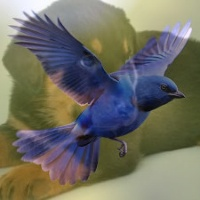
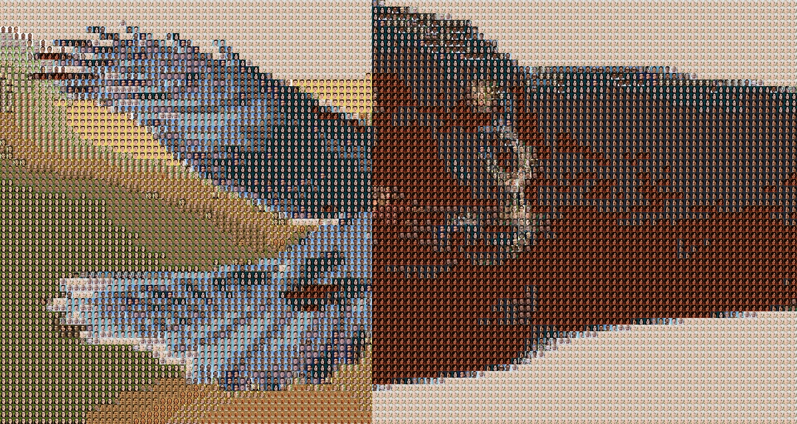

# 🧩 Générateur de Mosaïques d'Images
Projet réalisé en 2023/2024 dans le cadre d’un projet d'informatique de CPBx par Kitchi-Tawa BOURGUINAT

Créez des mosaïques et animations visuelles à partir de vos collections de photos.

## 🚀 Fonctionnalités Principales

- 🖼️ Génération de mosaïques d'images (à partir d'une photo source et d'une collection de miniatures)
- 🎥 Création d'animations et effets vidéo (apparition, zoom, fondu…)
- ✨ Effets d'apparition pixelisée
- 🔍 Zoom précis sur points spécifiques
- 🖌️ Fusion et transitions d'images
- 🖥️ Interface graphique intuitive (Tkinter)

## Organisation des Fichiers

📂 projet/

├── 📄 apparition.py        ------------>       # Animation d'apparition pixel par pixel

├── 📄 concat_opac.py       ------------>       # Fondu entre images et effets de transition

├── 📄 interface.py         ------------>       # Interface utilisateur graphique (Tkinter)

├── 📄 mosaic.py            ------------>       # Cœur de génération des mosaïques

├── 📄 mosaic_rep.py        ------------>       # Mosaïques à partir de répertoires d'images

├── 📄 zoom_precis.py       ------------>       # Effets de zoom avancés et ciblés

├── 📄 make_video.py        ------------>       # Génération de vidéos à partir de zooms

├── 📄 make_movie.py        ------------>       # Zoom animé sur une seule image

└── 📄 make_movie_rep.py    ------------>       # Zoom animé sur mosaïque (via dossier miniatures)

## 🧪 Prérequis

- Python 3.8+
- 📦 Bibliothèques requises :
pip install opencv-python numpy tqdm Pillow

## ⚡ Utilisation Rapide

1. ▶️ **Lancer l’interface graphique** : python interface.py

2. 🧱 **Générer une mosaïque simple** : python mosaic.py image_source.jpg miniature.jpg 20 sortie.jpg

3. 🎬 **Créer une vidéo de zoom à partir d’une image** : python make_movie.py image_source.jpg sortie.mp4 2 9

4. 🎞️ **Créer une vidéo de zoom depuis une mosaïque complète (dossier miniatures)** : python make_movie_rep.py image.jpg dossier_miniatures/ 2 9 video.mp4

# ✅ Bonnes Pratiques
- 📐 Utilisez des miniatures carrées et homogènes (10 à 30 px de côté)
- 🎨 Privilégiez une bonne diversité de couleurs
- 🎥 Pour des vidéos fluides : 60 FPS recommandés
- 🗂️ Organisez bien vos répertoires d’entrée et sortie (images, mosaïques, vidéos)

## 🎥 Aperçu Visuel

  

